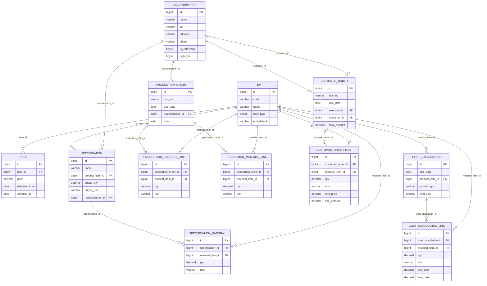

# Модуль 1. Пример решения ER-диаграммы

Ниже представлен пример решения задания Модуля 1.

---

## Предметная область

Молочный завод производит продукцию (йогурт, напитки) из материалов (молоко, сахар, какао) по спецификациям, реализует готовую продукцию заказчикам.

- Каждый **продукт** производится по **спецификации**, в которой перечислены необходимые **материалы** и нормы их расхода.
- **Заказчики** формируют **заказы** на продукцию.
- **Цены** на материалы хранятся отдельно с учётом дат действия.

---

## Анализ документов заказчика

Ниже приведён анализ каждого приложения из `Прил_1_ОЗ_КОД 09.02.07-5-2026-М1.rar` и выводы для ER-модели.

### Справочник контрагентов (`Заказчики.json`)

Структура JSON-файла:

```json
[
  { "id": "000000001", "name": "ООО \"Поставка\"",       "inn": "",             "addres": "г.Пятигорск",                       "phone": "+79198634592", "salesman": true,  "buyer": true  },
  { "id": "000000003", "name": "ООО \"Ромашка\"",        "inn": "4140784214",   "addres": "г. Омск, ул. Строителей, 294",      "phone": "+79882584546", "salesman": false, "buyer": true  },
  { "id": "000000009", "name": "ООО \"Ипподром\"",       "inn": "5874045632",   "addres": "г. Уфа, ул. Набережная, 37",        "phone": "+79627486389", "salesman": true,  "buyer": true  }
]
```

**Вывод:** один контрагент совмещает несколько ролей → сущность `Counterparty` с булевыми полями `is_salesman`, `is_buyer`, без разделения на разные таблицы.

> **Внимание:** в JSON поле называется `addres` (опечатка) — при импорте нужно сопоставить с `address`.

### Прайс-лист (`Цены.xlsx`)

| Продукция / Материалы | Цена |
|----------------------|-----:|
| Закваска сметанная | 45,00 |
| Молоко нормализованное | 34,00 |
| Сметана классическая 15% 540г. | 89,00 |
| Кефир 2,5% 900г. | 80,00 |

В одном списке присутствуют и готовая продукция, и материалы — коды совпадают с другими документами.

**Вывод:** единый справочник `Item` (тип `product`/`material`), цены выделяются в `Price` со ссылкой по FK на `Item`.

### Спецификация (`Спецификация.xlsx`)

| Продукция | Материал | Ед. изм. | Количество |
|-----------|---------|---------|----------:|
| Сметана классическая 15% 540г. | Молоко нормализованное | кг | 0,900 |
| Сметана классическая 15% 540г. | Закваска сметанная | кг | 0,070 |

**Вывод:** связь «спецификация ↔ материалы» — M:N → нужна таблица-связка `SpecificationMaterial` с полем `qty`.

### Производство (`Производство.xlsx`)

Документ содержит два независимых блока: выпуск продукции и списание материалов, с единым форматом кодов (НФ-...).

**Вывод:** `ProductionOrder` (шапка) + `ProductionProductLine` (выпуск) + `ProductionMaterialLine` (списание).

### Заказ покупателя (`Заказ покупателя.xlsx`)

Цена фиксируется **на момент оформления** — не переписывается при изменении прайса.

**Вывод:** `CustomerOrder` (исполнитель + заказчик) + `CustomerOrderLine` с полем `unit_price`.

### Расчёт стоимости (`Расчёт стоимости продукции.xlsx`)

| Материал | Ед. | Кол-во | Цена | Стоимость |
|----------|-----|-------:|-----:|---------:|
| Молоко нормализованное | кг | 0,900 | 40,00 | 36,00 |
| Закваска сметанная | кг | 0,070 | 10,00 | 0,70 |
| **Итого** | | | | **36,70** |

**Вывод:** `CostCalculation` (шапка) + `CostCalculationLine` (строки с ценой материала на дату расчёта).

---

## ER-модель

### Сущности

| Сущность | Ключевые поля | Назначение |
|----------|--------------|-----------|
| `Counterparty` | id, name, inn, address, phone, is_salesman, is_buyer | Контрагенты (поставщики и покупатели) |
| `Item` | id, code, name, item_type (product/material), unit_default | Номенклатура (продукты и материалы) |
| `Price` | id, item_id FK, price, effective_from, effective_to | Цены номенклатуры |
| `Specification` | id, name, product_item_id FK→Item, output_qty, output_unit, manufacturer_id FK→Counterparty | Спецификации производства |
| `SpecificationMaterial` | id, specification_id FK, material_item_id FK→Item, qty, unit | Материалы спецификации (связка M:N) |
| `ProductionOrder` | id, doc_no, doc_date, manufacturer_id FK, note | Производственные заказы |
| `ProductionProductLine` | id, production_order_id FK, product_item_id FK, qty, unit | Строки выпуска продукции |
| `ProductionMaterialLine` | id, production_order_id FK, material_item_id FK, qty, unit | Строки расхода материалов |
| `CustomerOrder` | id, doc_no, doc_date, executor_id FK, customer_id FK, total_amount | Заказы покупателей |
| `CustomerOrderLine` | id, customer_order_id FK, product_item_id FK, qty, unit, unit_price, line_amount | Строки заказа покупателя |
| `CostCalculation` | id, calc_date, product_item_id FK, product_qty, total_cost | Расчёт себестоимости |
| `CostCalculationLine` | id, cost_calculation_id FK, material_item_id FK, qty, unit, unit_cost, line_cost | Строки расчёта себестоимости |

---

## ER-диаграмма (Mermaid)



---

## Таблица связей

| Таблица (FK сторона) | Ссылается на | Тип связи | Смысл |
|---------------------|-------------|:---------:|-------|
| `price` | `item` | 1:M | У каждой номенклатуры может быть несколько цен (по датам) |
| `specification` | `item` (product) | 1:M | Один продукт может иметь несколько спецификаций |
| `specification` | `counterparty` | 1:M | Спецификация привязана к производителю |
| `specification_material` | `specification` | M:N | Спецификация содержит несколько материалов |
| `specification_material` | `item` (material) | M:N | Материал входит в несколько спецификаций |
| `production_order` | `counterparty` | 1:M | Производственный заказ от одного производителя |
| `production_product_line` | `production_order` | 1:M | В одном заказе несколько строк выпуска |
| `production_product_line` | `item` (product) | 1:M | Строка ссылается на продукт |
| `production_material_line` | `production_order` | 1:M | В одном заказе несколько строк расхода |
| `production_material_line` | `item` (material) | 1:M | Строка ссылается на материал |
| `customer_order` | `counterparty` (executor) | 1:M | Исполнитель заказа |
| `customer_order` | `counterparty` (customer) | 1:M | Покупатель заказа |
| `customer_order_line` | `customer_order` | 1:M | В одном заказе несколько позиций |
| `customer_order_line` | `item` (product) | 1:M | Позиция ссылается на продукт |
| `cost_calculation` | `item` (product) | 1:M | Расчёт себестоимости для продукта |
| `cost_calculation_line` | `cost_calculation` | 1:M | Строки расчёта |
| `cost_calculation_line` | `item` (material) | 1:M | Материал в строке расчёта |

---

## Соответствие 3НФ

Модель соответствует третьей нормальной форме:

- Коды и наименования хранятся однократно в таблице `Item` — нет дублирования данных.
- Документы (`ProductionOrder`, `CustomerOrder`) содержат только FK и реквизиты сделки, не дублируя справочные данные.
- Цены выделены в отдельную таблицу `Price` с периодами действия (`effective_from`, `effective_to`).
- Нормативный состав продукта хранится в `SpecificationMaterial`, не в строках заказа.
- Все неключевые атрибуты зависят только от первичного ключа своей таблицы.
