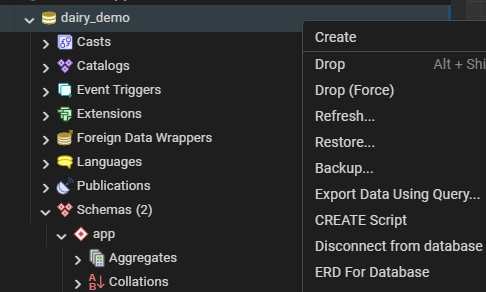
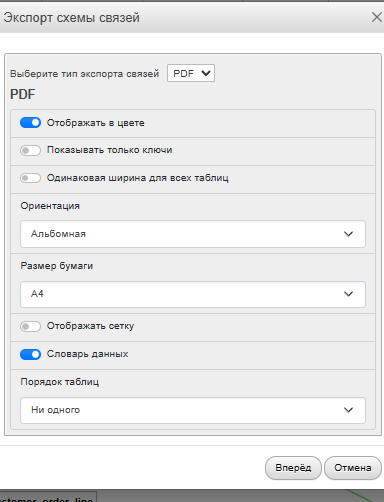

# Модуль 2. Разработка базы данных по ER-диаграмме (MySQL через phpMyAdmin)

**Цель:** создать БД и таблицы по ER, настроить PK/FK/ограничения, затем импортировать `Заказчики.json`.

---

## 0. Важно перед стартом

* Везде ниже используется один вариант выполнения: **SQL-запрос (DDL/DML)**
* Рекомендуемая структура: используем одну БД `dairy_demo`. Все таблицы создаются внутри базы данных.

---

## 1. Создание базы данных

```sql
CREATE DATABASE IF NOT EXISTS dairy_demo
  DEFAULT CHARACTER SET utf8mb4
  DEFAULT COLLATE utf8mb4_unicode_ci;
```

---

## 2. Создание таблиц

> Для внешних ключей используйте движок **InnoDB** (обычно по умолчанию).

### Counterparty

```sql
CREATE TABLE IF NOT EXISTS counterparty (
    id           BIGINT NOT NULL AUTO_INCREMENT,
    name         VARCHAR(255) NOT NULL,
    inn          VARCHAR(32) NULL,
    address      VARCHAR(255) NULL,
    phone        VARCHAR(64) NULL,
    is_salesman  TINYINT(1) NOT NULL DEFAULT 0,
    is_buyer     TINYINT(1) NOT NULL DEFAULT 0,
    PRIMARY KEY (id)
) ENGINE=InnoDB DEFAULT CHARSET=utf8mb4;
```

### Item

```sql
CREATE TABLE IF NOT EXISTS item (
    id           BIGINT NOT NULL AUTO_INCREMENT,
    code         VARCHAR(64) UNIQUE,
    name         VARCHAR(255) NOT NULL,
    item_type    ENUM('product','material') NOT NULL,
    unit_default VARCHAR(32) NULL,
    PRIMARY KEY (id)
) ENGINE=InnoDB DEFAULT CHARSET=utf8mb4;
```

### Price

```sql
CREATE TABLE IF NOT EXISTS price (
    id             BIGINT NOT NULL AUTO_INCREMENT,
    item_id        BIGINT NOT NULL,
    price          DECIMAL(12,2) NOT NULL,
    effective_from DATE NULL,
    effective_to   DATE NULL,
    PRIMARY KEY (id),
    CONSTRAINT fk_price_item
      FOREIGN KEY (item_id) REFERENCES item(id)
      ON UPDATE CASCADE ON DELETE RESTRICT
) ENGINE=InnoDB DEFAULT CHARSET=utf8mb4;
```

### Specification и Specification_Material

```sql
CREATE TABLE IF NOT EXISTS specification (
    id              BIGINT NOT NULL AUTO_INCREMENT,
    name            VARCHAR(255) NOT NULL,
    product_item_id BIGINT NOT NULL,
    output_qty      DECIMAL(12,3) NOT NULL DEFAULT 1.000,
    output_unit     VARCHAR(32) NULL,
    manufacturer_id BIGINT NULL,
    PRIMARY KEY (id),
    CONSTRAINT fk_spec_product
      FOREIGN KEY (product_item_id) REFERENCES item(id)
      ON UPDATE CASCADE ON DELETE RESTRICT,
    CONSTRAINT fk_spec_manufacturer
      FOREIGN KEY (manufacturer_id) REFERENCES counterparty(id)
      ON UPDATE CASCADE ON DELETE RESTRICT
) ENGINE=InnoDB DEFAULT CHARSET=utf8mb4;

CREATE TABLE IF NOT EXISTS specification_material (
    id               BIGINT NOT NULL AUTO_INCREMENT,
    specification_id BIGINT NOT NULL,
    material_item_id BIGINT NOT NULL,
    qty              DECIMAL(12,3) NOT NULL,
    unit             VARCHAR(32) NULL,
    PRIMARY KEY (id),
    UNIQUE KEY uq_spec_material (specification_id, material_item_id),
    CONSTRAINT fk_specmat_spec
      FOREIGN KEY (specification_id) REFERENCES specification(id)
      ON UPDATE CASCADE ON DELETE CASCADE,
    CONSTRAINT fk_specmat_material
      FOREIGN KEY (material_item_id) REFERENCES item(id)
      ON UPDATE CASCADE ON DELETE RESTRICT
) ENGINE=InnoDB DEFAULT CHARSET=utf8mb4;
```

### Production Order

```sql
CREATE TABLE IF NOT EXISTS production_order (
    id              BIGINT NOT NULL AUTO_INCREMENT,
    doc_no          VARCHAR(64) NOT NULL,
    doc_date        DATE NULL,
    manufacturer_id BIGINT NULL,
    note            TEXT NULL,
    PRIMARY KEY (id),
    CONSTRAINT fk_prodorder_manufacturer
      FOREIGN KEY (manufacturer_id) REFERENCES counterparty(id)
      ON UPDATE CASCADE ON DELETE RESTRICT
) ENGINE=InnoDB DEFAULT CHARSET=utf8mb4;

CREATE TABLE IF NOT EXISTS production_product_line (
    id                  BIGINT NOT NULL AUTO_INCREMENT,
    production_order_id BIGINT NOT NULL,
    product_item_id     BIGINT NOT NULL,
    qty                 DECIMAL(12,3) NOT NULL,
    unit                VARCHAR(32) NULL,
    PRIMARY KEY (id),
    CONSTRAINT fk_prodprod_order
      FOREIGN KEY (production_order_id) REFERENCES production_order(id)
      ON UPDATE CASCADE ON DELETE CASCADE,
    CONSTRAINT fk_prodprod_item
      FOREIGN KEY (product_item_id) REFERENCES item(id)
      ON UPDATE CASCADE ON DELETE RESTRICT
) ENGINE=InnoDB DEFAULT CHARSET=utf8mb4;

CREATE TABLE IF NOT EXISTS production_material_line (
    id                  BIGINT NOT NULL AUTO_INCREMENT,
    production_order_id BIGINT NOT NULL,
    material_item_id    BIGINT NOT NULL,
    qty                 DECIMAL(12,3) NOT NULL,
    unit                VARCHAR(32) NULL,
    PRIMARY KEY (id),
    CONSTRAINT fk_prodmat_order
      FOREIGN KEY (production_order_id) REFERENCES production_order(id)
      ON UPDATE CASCADE ON DELETE CASCADE,
    CONSTRAINT fk_prodmat_item
      FOREIGN KEY (material_item_id) REFERENCES item(id)
      ON UPDATE CASCADE ON DELETE RESTRICT
) ENGINE=InnoDB DEFAULT CHARSET=utf8mb4;
```

### Customer Order

```sql
CREATE TABLE IF NOT EXISTS customer_order (
    id           BIGINT NOT NULL AUTO_INCREMENT,
    doc_no       VARCHAR(64) NOT NULL,
    doc_date     DATE NULL,
    executor_id  BIGINT NULL,
    customer_id  BIGINT NULL,
    total_amount DECIMAL(12,2) NULL,
    PRIMARY KEY (id),
    CONSTRAINT fk_custorder_executor
      FOREIGN KEY (executor_id) REFERENCES counterparty(id)
      ON UPDATE CASCADE ON DELETE RESTRICT,
    CONSTRAINT fk_custorder_customer
      FOREIGN KEY (customer_id) REFERENCES counterparty(id)
      ON UPDATE CASCADE ON DELETE RESTRICT
) ENGINE=InnoDB DEFAULT CHARSET=utf8mb4;

CREATE TABLE IF NOT EXISTS customer_order_line (
    id                BIGINT NOT NULL AUTO_INCREMENT,
    customer_order_id BIGINT NOT NULL,
    product_item_id   BIGINT NOT NULL,
    qty               DECIMAL(12,3) NOT NULL,
    unit              VARCHAR(32) NULL,
    unit_price        DECIMAL(12,2) NULL,
    line_amount       DECIMAL(12,2) NULL,
    PRIMARY KEY (id),
    CONSTRAINT fk_custline_order
      FOREIGN KEY (customer_order_id) REFERENCES customer_order(id)
      ON UPDATE CASCADE ON DELETE CASCADE,
    CONSTRAINT fk_custline_item
      FOREIGN KEY (product_item_id) REFERENCES item(id)
      ON UPDATE CASCADE ON DELETE RESTRICT
) ENGINE=InnoDB DEFAULT CHARSET=utf8mb4;
```

### Cost Calculation

```sql
CREATE TABLE IF NOT EXISTS cost_calculation (
    id              BIGINT NOT NULL AUTO_INCREMENT,
    calc_date       DATE NULL,
    product_item_id BIGINT NOT NULL,
    product_qty     DECIMAL(12,3) NOT NULL DEFAULT 1.000,
    total_cost      DECIMAL(12,2) NULL,
    PRIMARY KEY (id),
    CONSTRAINT fk_costcalc_product
      FOREIGN KEY (product_item_id) REFERENCES item(id)
      ON UPDATE CASCADE ON DELETE RESTRICT
) ENGINE=InnoDB DEFAULT CHARSET=utf8mb4;

CREATE TABLE IF NOT EXISTS cost_calculation_line (
    id                  BIGINT NOT NULL AUTO_INCREMENT,
    cost_calculation_id BIGINT NOT NULL,
    material_item_id    BIGINT NOT NULL,
    qty                 DECIMAL(12,3) NOT NULL,
    unit                VARCHAR(32) NULL,
    unit_cost           DECIMAL(12,2) NULL,
    line_cost           DECIMAL(12,2) NULL,
    PRIMARY KEY (id),
    CONSTRAINT fk_costline_calc
      FOREIGN KEY (cost_calculation_id) REFERENCES cost_calculation(id)
      ON UPDATE CASCADE ON DELETE CASCADE,
    CONSTRAINT fk_costline_item
      FOREIGN KEY (material_item_id) REFERENCES item(id)
      ON UPDATE CASCADE ON DELETE RESTRICT
) ENGINE=InnoDB DEFAULT CHARSET=utf8mb4;
```

---

## 3. Импорт Заказчики.json

### Вариант 1 (рекомендуется): JSON → SQL

Преобразуйте `Заказчики.json` в SQL и импортируйте через phpMyAdmin → **Import**:

```sql
INSERT INTO counterparty (name, inn, address, phone, is_salesman, is_buyer) VALUES
('ООО Ромашка', '1234567890', 'г. Москва, ул. Ленина, 1', '+7 900 000-00-01', 1, 0),
('ИП Иванов',   NULL,         'г. Казань',                NULL,               0, 1);
```

### Вариант 2 (MySQL 8+): JSON_TABLE

```sql
INSERT INTO counterparty (id, name, inn, address, phone, is_salesman, is_buyer)
SELECT jt.id, jt.name, NULLIF(jt.inn,''), NULLIF(jt.address,''), NULLIF(jt.phone,''),
       IFNULL(jt.salesman,0), IFNULL(jt.buyer,0)
FROM (SELECT CAST('[{"id":1,"name":"ООО Ромашка","salesman":true,"buyer":false}]' AS JSON) AS payload) t
JOIN JSON_TABLE(t.payload, '$[*]' COLUMNS (
  id       BIGINT       PATH '$.id',
  name     VARCHAR(255) PATH '$.name',
  inn      VARCHAR(32)  PATH '$.inn'      NULL ON ERROR,
  address  VARCHAR(255) PATH '$.address'  NULL ON ERROR,
  phone    VARCHAR(64)  PATH '$.phone'    NULL ON ERROR,
  salesman TINYINT(1)   PATH '$.salesman' DEFAULT 0 ON EMPTY DEFAULT 0 ON ERROR,
  buyer    TINYINT(1)   PATH '$.buyer'    DEFAULT 0 ON EMPTY DEFAULT 0 ON ERROR
)) AS jt;
```

---

## 4. Проверка базы данных

```sql
SHOW TABLES;
SELECT COUNT(*) FROM counterparty;
SHOW CREATE TABLE customer_order_line;
```

После создания убедитесь, что все таблицы созданы и FK присутствуют.



/// caption
Рисунок 1 – Проверка таблиц в phpMyAdmin
///



/// caption
Рисунок 2 – ER-диаграмма через Designer phpMyAdmin
///

---

## 5. Скачать готовую базу данных

[:material-download: Скачать dairy_demo.sql](../files/dairy_demo.sql){ .md-button }
