# Модуль 2. Пример решения — через конструктор phpMyAdmin

**Цель:** создать БД и таблицы по ER через графический интерфейс phpMyAdmin (без написания SQL вручную), затем импортировать `Заказчики.json`.

---

## 1. Запуск XAMPP и открытие phpMyAdmin

1. Запустите **XAMPP Control Panel**.

   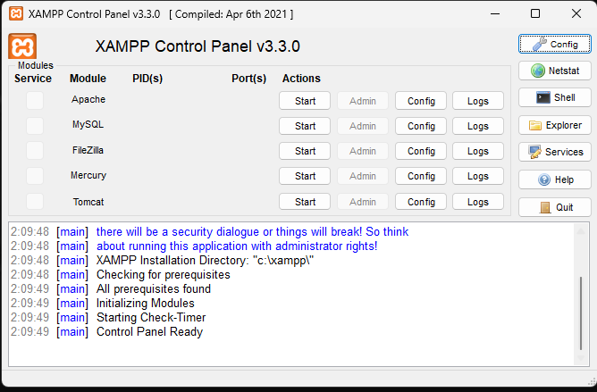

   /// caption
   Рисунок 1 – Открытие XAMPP Control Panel
   ///

2. Нажмите **Start** в строке **Apache** → дождитесь статуса **Running**.

   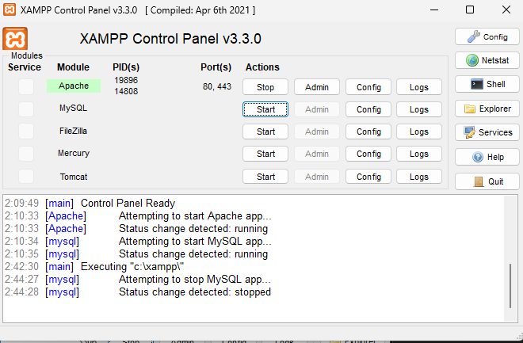

   /// caption
   Рисунок 2 – Запуск Apache
   ///

3. Нажмите **Start** в строке **MySQL** → дождитесь статуса **Running**.

   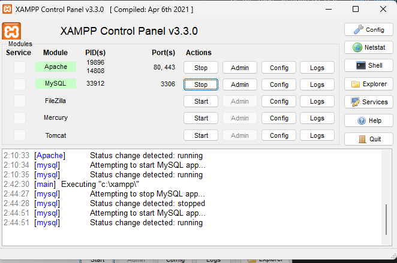

   /// caption
   Рисунок 3 – Запуск MySQL
   ///

4. Откройте phpMyAdmin:

   **Вариант A:** кнопка **Admin** в строке MySQL.

   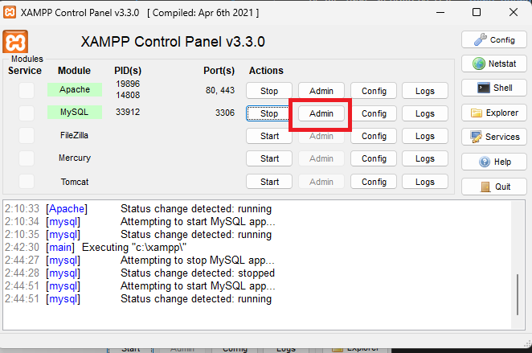

   /// caption
   Рисунок 4 – Открытие через кнопку Admin
   ///

   **Вариант B:** в браузере `http://localhost/phpmyadmin/`

   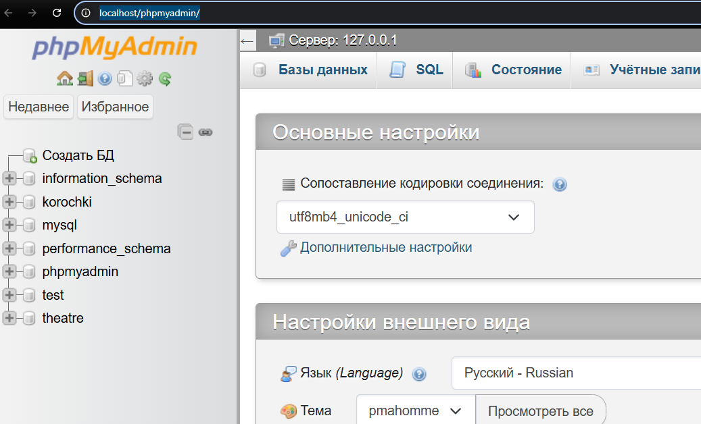

   /// caption
   Рисунок 5 – Открытие через браузер
   ///

5. Убедитесь, что phpMyAdmin открылся без ошибок.

   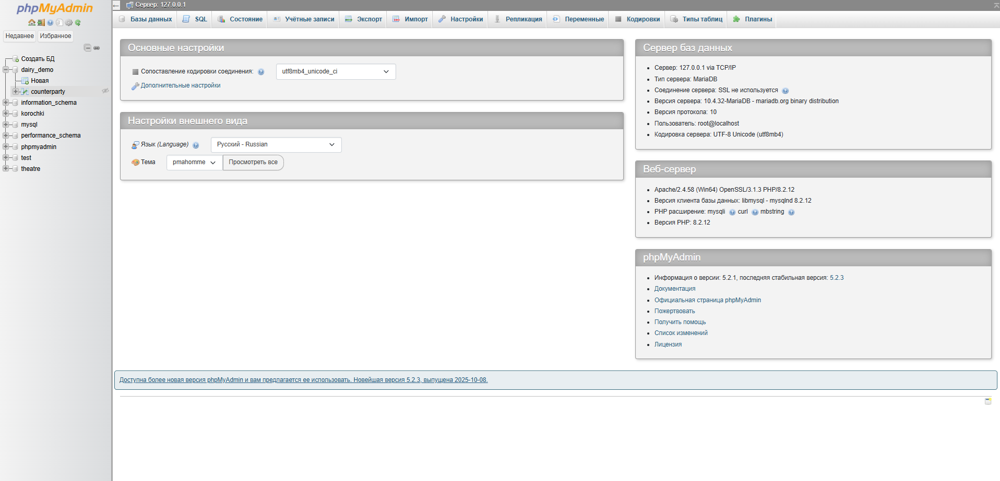

   /// caption
   Рисунок 6 – Главная страница phpMyAdmin
   ///

---

## 2. Создание базы данных

1. Вкладка **Databases** → в поле **Create database** введите `dairy_demo`.
2. Collation: `utf8mb4_unicode_ci`.
3. Нажмите **Create**.

   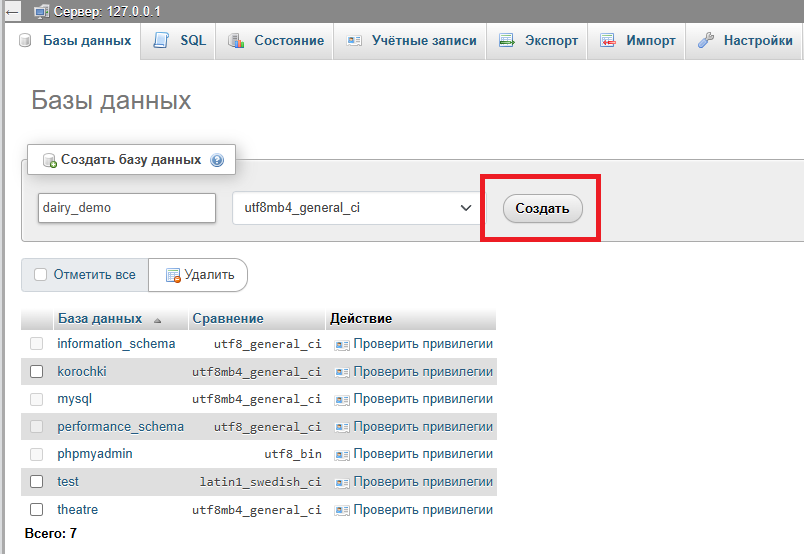

   /// caption
   Рисунок 7 – Создание базы данных `dairy_demo`
   ///

4. БД `dairy_demo` появится в левой панели.

   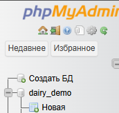

   /// caption
   Рисунок 8 – База данных в дереве phpMyAdmin
   ///

---

## 3. Создание таблиц через конструктор

> Для каждой таблицы: выберите `dairy_demo` → вкладка **Structure** → **Create table**.

---

### 3.1. COUNTERPARTY

Имя таблицы: `counterparty`, количество столбцов: **7**.

| Field | Type | Length | Null | Default | Index | Extra |
|-------|------|--------|------|---------|-------|-------|
| id | BIGINT | | NO | | PRIMARY | AUTO_INCREMENT |
| name | VARCHAR | 255 | NO | | | |
| inn | VARCHAR | 32 | YES | NULL | | |
| address | VARCHAR | 255 | YES | NULL | | |
| phone | VARCHAR | 64 | YES | NULL | | |
| is_salesman | TINYINT | 1 | NO | 0 | | |
| is_buyer | TINYINT | 1 | NO | 0 | | |

- Engine: **InnoDB**, Collation: `utf8mb4_unicode_ci`

   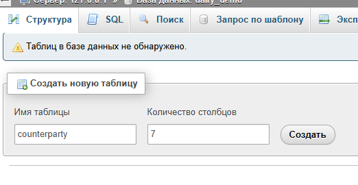

   /// caption
   Рисунок 9 – Задание имени и структуры таблицы
   ///

   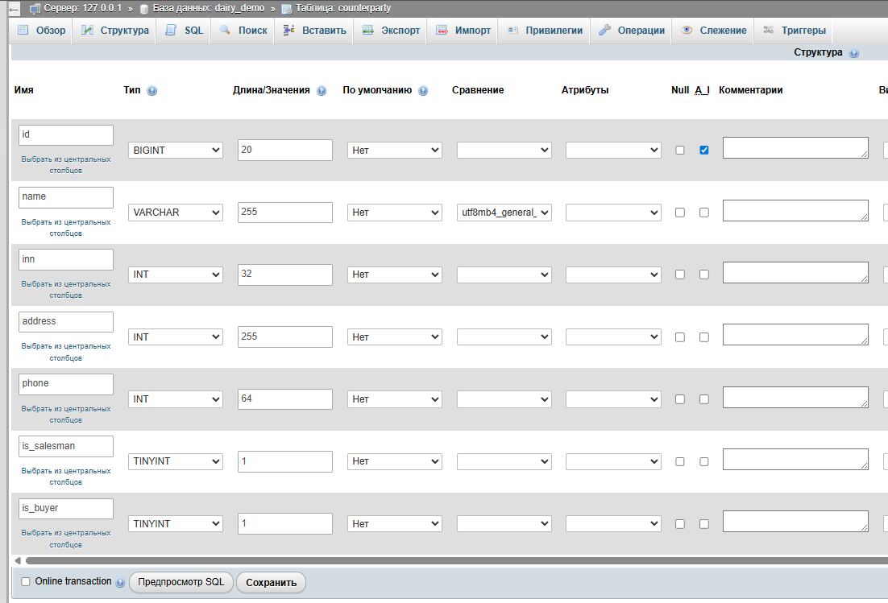

   /// caption
   Рисунок 10 – Настройка полей таблицы `counterparty`
   ///

   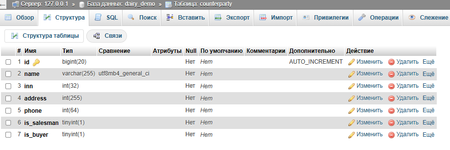

   /// caption
   Рисунок 11 – Проверка PRIMARY KEY и AUTO_INCREMENT
   ///

---

### 3.2. ITEM

Имя: `item`, столбцов: **5**.

| Field | Type | Length | Null | Default | Index | Extra |
|-------|------|--------|------|---------|-------|-------|
| id | BIGINT | | NO | | PRIMARY | AUTO_INCREMENT |
| code | VARCHAR | 64 | YES | NULL | UNIQUE | |
| name | VARCHAR | 255 | NO | | | |
| item_type | ENUM('product','material') | | NO | | | |
| unit_default | VARCHAR | 32 | YES | NULL | | |

   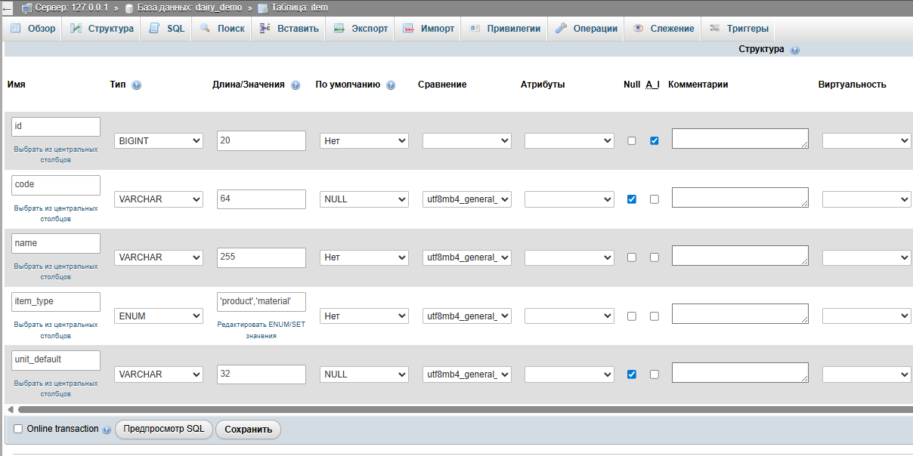

   /// caption
   Рисунок 12 – Таблица `item`
   ///

---

### 3.3. PRICE

Имя: `price`, столбцов: **5**.

| Field | Type | Length | Null | Default |
|-------|------|--------|------|---------|
| id | BIGINT | | NO | AUTO_INCREMENT, PK |
| item_id | BIGINT | | NO | |
| price | DECIMAL | 12,2 | NO | |
| effective_from | DATE | | YES | NULL |
| effective_to | DATE | | YES | NULL |

FK: `item_id` → `item(id)` ON UPDATE CASCADE ON DELETE RESTRICT

   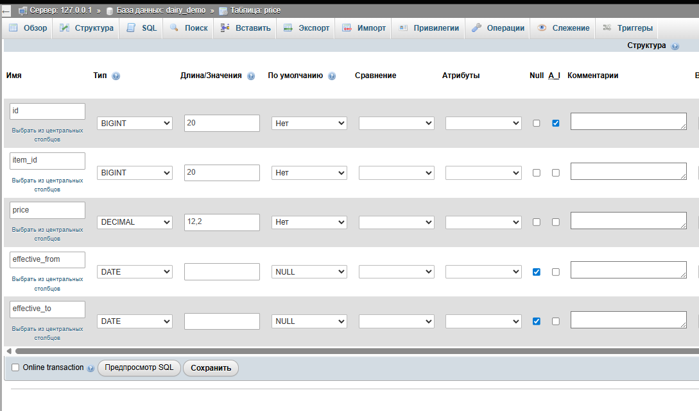

   /// caption
   Рисунок 13 – Таблица `price`
   ///

---

### 3.4. SPECIFICATION

| Field | Type | Null | Default |
|-------|------|------|---------|
| id | BIGINT AUTO_INCREMENT PK | NO | |
| name | VARCHAR(255) | NO | |
| product_item_id | BIGINT FK→item | NO | |
| output_qty | DECIMAL(12,3) | NO | 1.000 |
| output_unit | VARCHAR(32) | YES | NULL |
| manufacturer_id | BIGINT FK→counterparty | YES | NULL |

   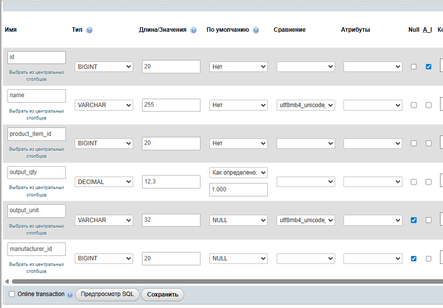

   /// caption
   Рисунок 14 – Таблица `specification`
   ///

### 3.5. SPECIFICATION_MATERIAL

| Field | Type | Null |
|-------|------|------|
| id | BIGINT AUTO_INCREMENT PK | NO |
| specification_id | BIGINT FK→specification | NO |
| material_item_id | BIGINT FK→item | NO |
| qty | DECIMAL(12,3) | NO |
| unit | VARCHAR(32) | YES |

Уникальное ограничение: `(specification_id, material_item_id)`

   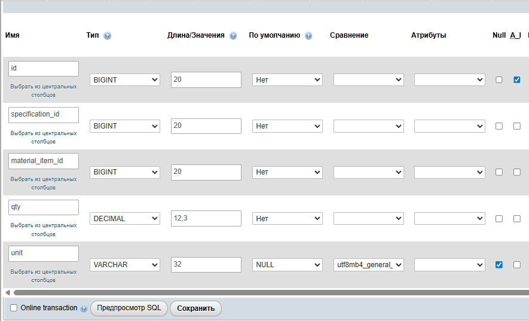

   /// caption
   Рисунок 15 – Таблица `specification_material`
   ///

---

### 3.6. PRODUCTION_ORDER, PRODUCTION_PRODUCT_LINE, PRODUCTION_MATERIAL_LINE

   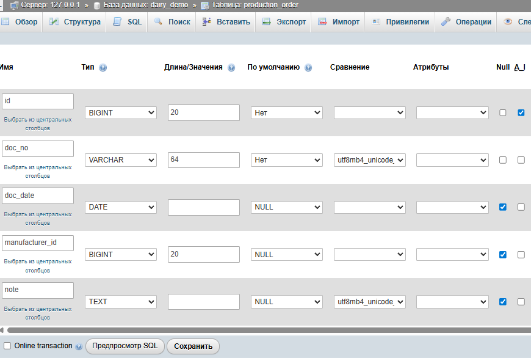

   /// caption
   Рисунок 16 – Таблица `production_order`
   ///

   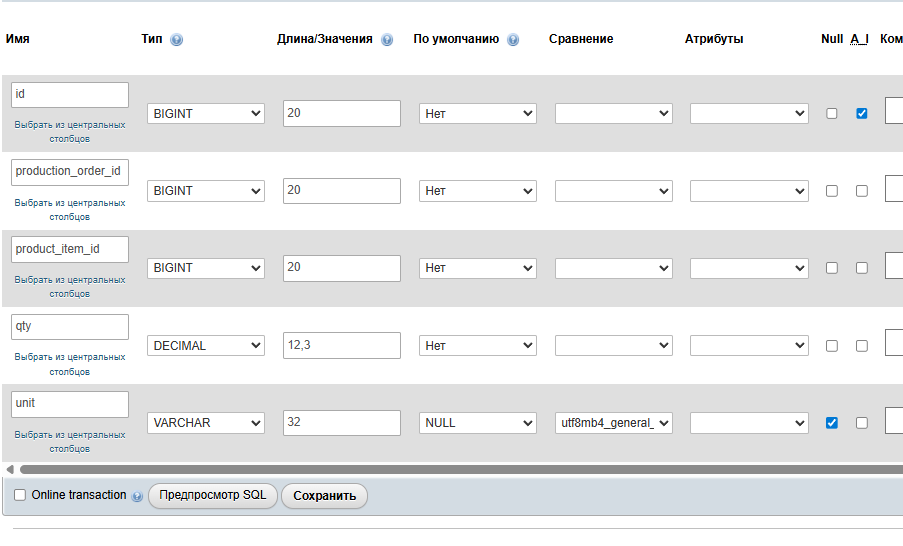

   /// caption
   Рисунок 17 – Таблица `production_product_line`
   ///

   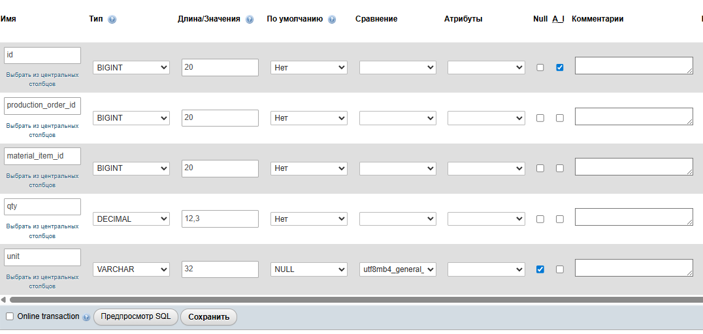

   /// caption
   Рисунок 18 – Таблица `production_material_line`
   ///

---

### 3.7. CUSTOMER_ORDER и CUSTOMER_ORDER_LINE

   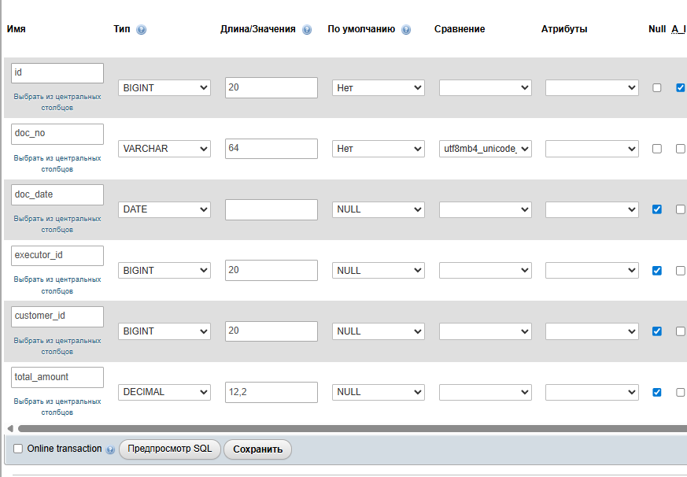

   /// caption
   Рисунок 19 – Таблица `customer_order`
   ///

   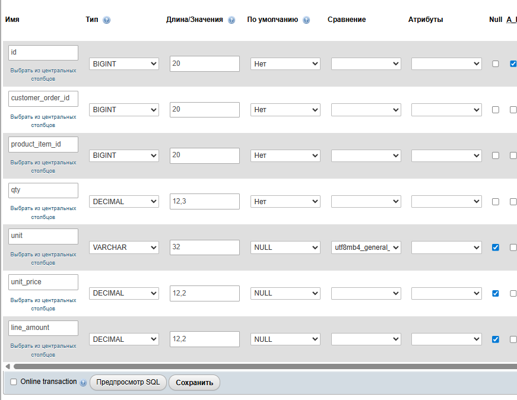

   /// caption
   Рисунок 20 – Таблица `customer_order_line`
   ///

---

### 3.8. COST_CALCULATION и COST_CALCULATION_LINE

   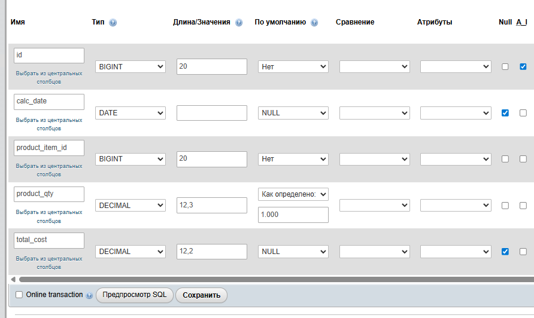

   /// caption
   Рисунок 21 – Таблица `cost_calculation`
   ///

   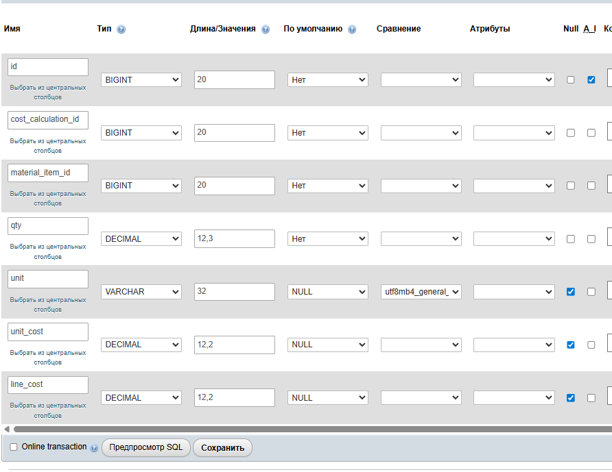

   /// caption
   Рисунок 22 – Таблица `cost_calculation_line`
   ///

---

## 4. Настройка внешних ключей (Relation view)

Для каждой таблицы: вкладка **Structure** → внизу кнопка **Relation view**.

   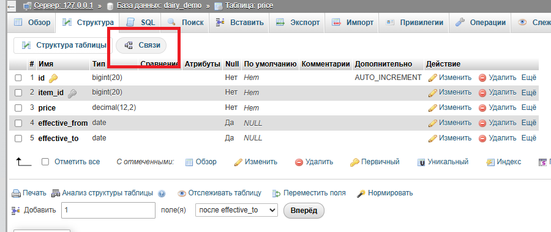

   /// caption
   Рисунок 23 – Переход в Relation view
   ///

### FK: price → item

   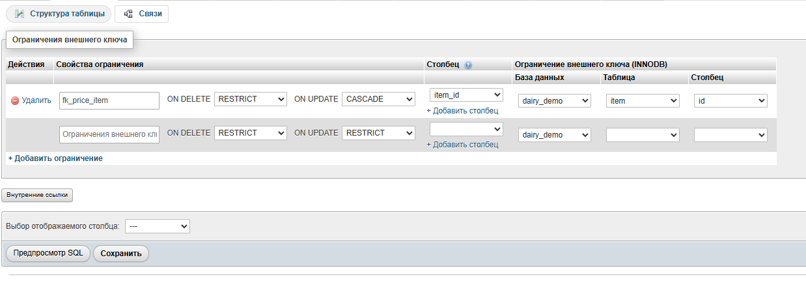

   /// caption
   Рисунок 24 – `price.item_id` → `item(id)` CASCADE/RESTRICT
   ///

### FK: specification

   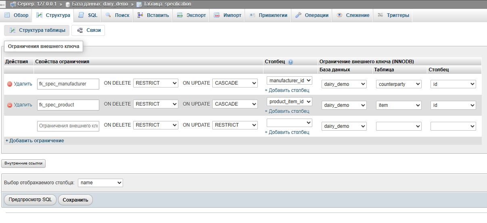

   /// caption
   Рисунок 25 – Связи таблицы `specification`
   ///

### FK: specification_material

   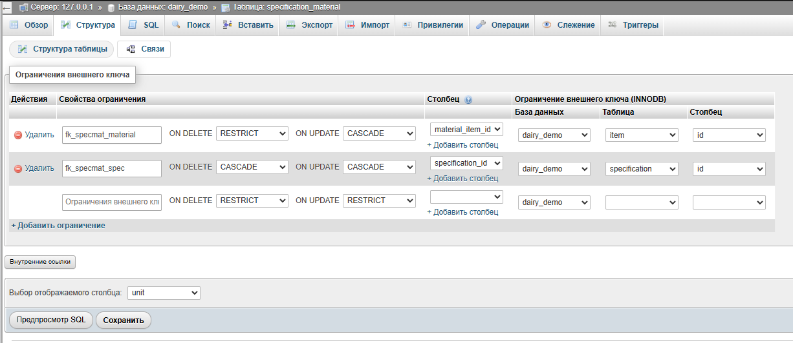

   /// caption
   Рисунок 26 – Связи таблицы `specification_material`
   ///

### FK: production_order

   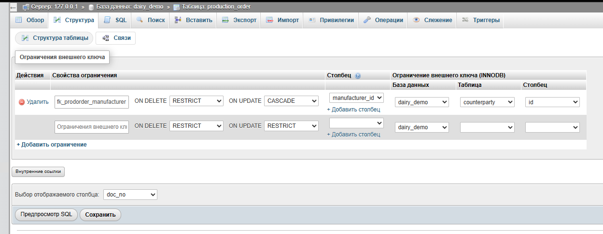

   /// caption
   Рисунок 27 – Связь `production_order` → `counterparty`
   ///

### FK: production_product_line

   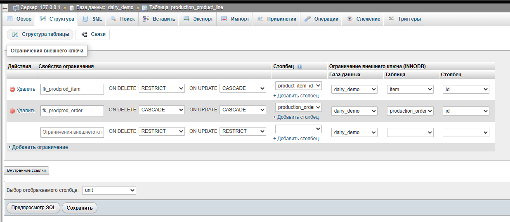

   /// caption
   Рисунок 28 – Связи `production_product_line`
   ///

### FK: production_material_line

   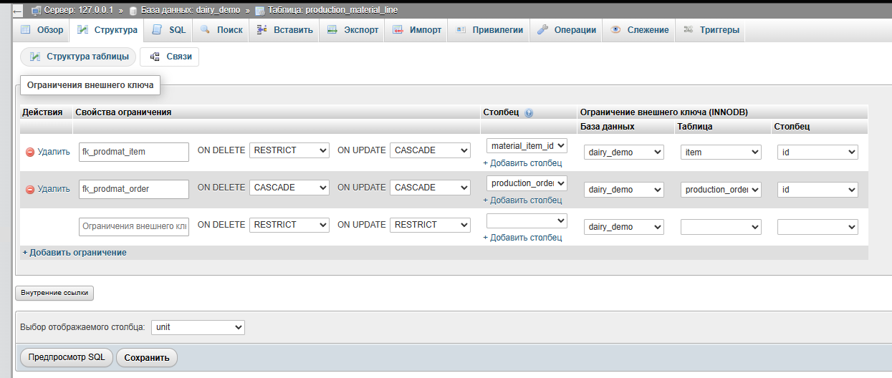

   /// caption
   Рисунок 29 – Связи `production_material_line`
   ///

### FK: customer_order

   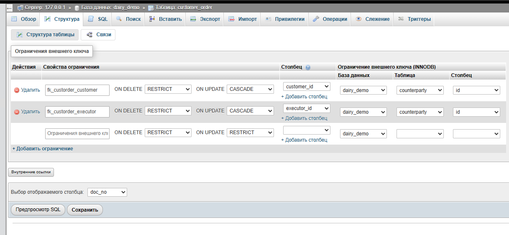

   /// caption
   Рисунок 30 – Связи `customer_order`
   ///

### FK: customer_order_line

   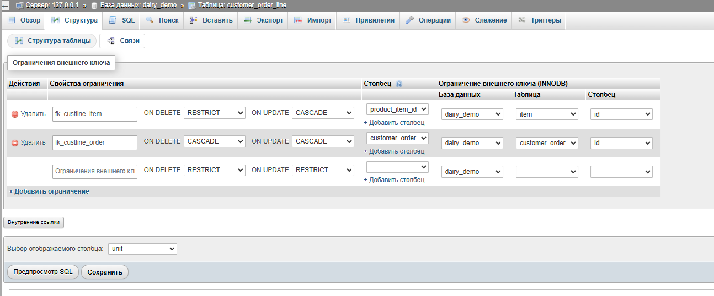

   /// caption
   Рисунок 31 – Связи `customer_order_line`
   ///

### FK: cost_calculation

   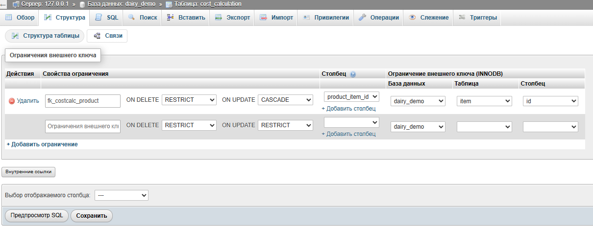

   /// caption
   Рисунок 32 – Связь `cost_calculation` → `item`
   ///

### FK: cost_calculation_line

   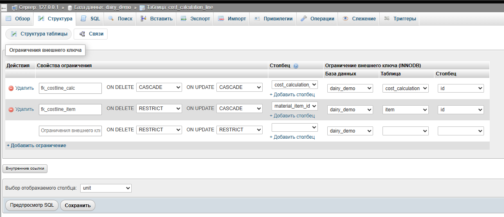

   /// caption
   Рисунок 33 – Связи `cost_calculation_line`
   ///

---

## 5. Импорт Заказчики.json через конструктор

> phpMyAdmin **не поддерживает прямой JSON-импорт** в структуру таблицы.
> Используйте подход: **JSON → CSV → Import**.

### Шаг 1: JSON → CSV через Excel (Power Query)

1. Excel → **Данные** → **Получить данные** → **Из файла** → **Из JSON**.
2. Выберите `Заказчики.json` → **Импортировать**.
3. В Power Query Editor: **To Table** → расширить столбцы.
4. Переименовать: `addres` → `address`, `salesman` → `is_salesman`, `buyer` → `is_buyer`.
5. Заменить: `TRUE` → `1`, `FALSE` → `0`.
6. **Закрыть и загрузить** → **Сохранить как CSV UTF-8**.

Итоговый CSV:
```csv
name,inn,address,phone,is_salesman,is_buyer
ООО "Ромашка",4140784214,"г. Омск, ул. Строителей, 294",+79882584546,0,1
```

### Шаг 2: Import CSV через phpMyAdmin

1. `dairy_demo` → таблица `counterparty` → вкладка **Import**.

   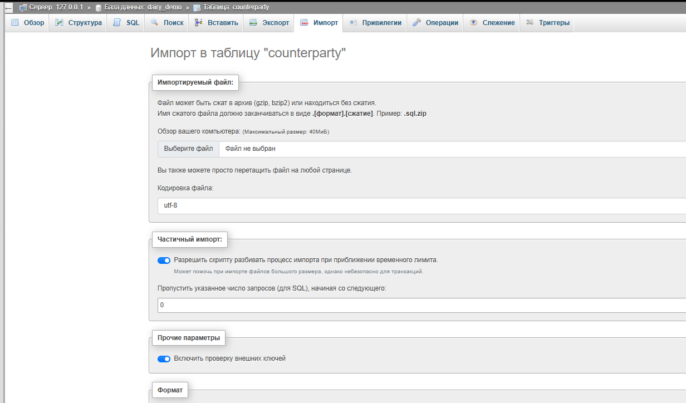

   /// caption
   Рисунок 34 – Вкладка Import в phpMyAdmin
   ///

2. **Choose file** → выберите `Заказчики.csv`.
3. Format: **CSV**. Отметьте: *The first line of the file contains the table column names*.
4. Character set: **utf-8**, разделитель: `,`.

   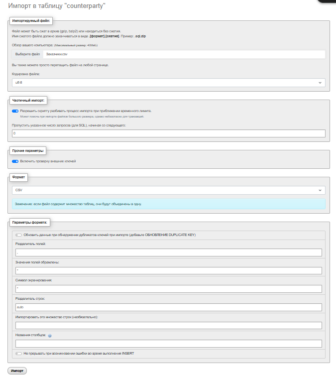

   /// caption
   Рисунок 35 – Настройки CSV-импорта
   ///

5. Нажмите **Go** → появится сообщение `Import has been successfully finished`.

---

## 6. Проверка структуры БД

После создания всех таблиц и связей откройте вкладку **Designer** для визуальной проверки ER.

   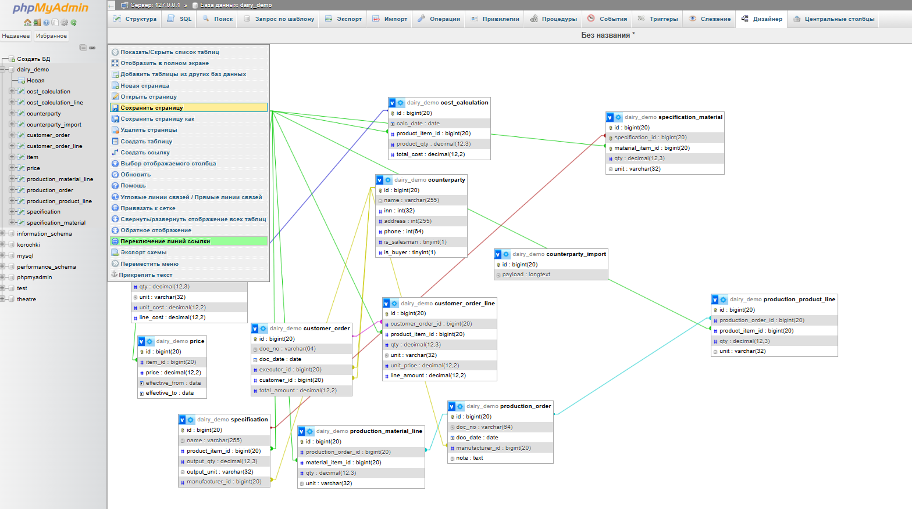

   /// caption
   Рисунок 36 – ER-диаграмма в Designer phpMyAdmin
   ///

   

   /// caption
   Рисунок 37 – Экспорт структуры для подтверждения
   ///

---

## 7. Скачать готовую базу данных

[:material-download: Скачать dairy_demo.sql](../files/dairy_demo.sql){ .md-button }
