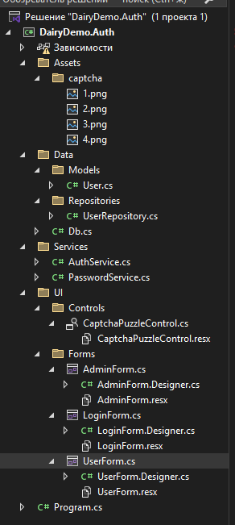
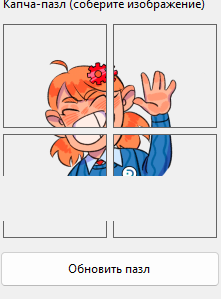
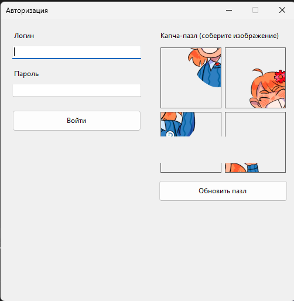
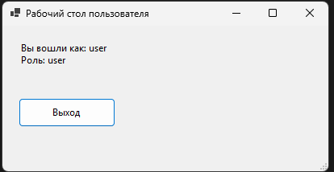
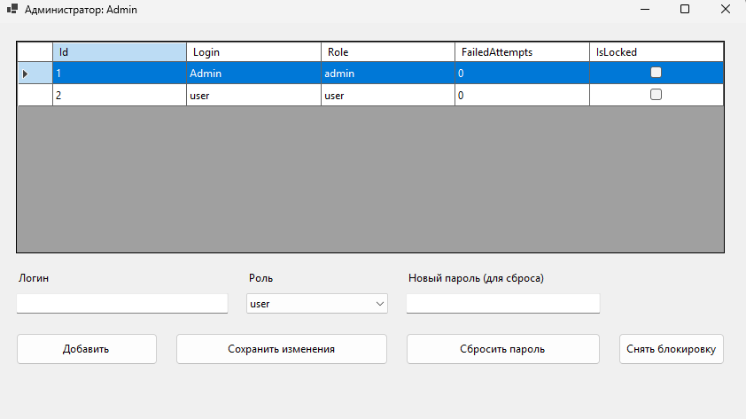

# Модуль 4. Пример решения — форма авторизации (Windows Forms + MySQL)

---

## 1. Доработка БД: таблица `users`

Выполните в phpMyAdmin (база `dairy_demo`):

```sql
CREATE TABLE IF NOT EXISTS users (
    id              BIGINT NOT NULL AUTO_INCREMENT,
    login           VARCHAR(64) NOT NULL,
    password_hash   VARCHAR(255) NOT NULL,
    role            ENUM('admin','user') NOT NULL DEFAULT 'user',
    failed_attempts INT NOT NULL DEFAULT 0,
    is_locked       TINYINT(1) NOT NULL DEFAULT 0,
    created_at      TIMESTAMP NOT NULL DEFAULT CURRENT_TIMESTAMP,
    updated_at      TIMESTAMP NOT NULL DEFAULT CURRENT_TIMESTAMP ON UPDATE CURRENT_TIMESTAMP,
    PRIMARY KEY (id),
    UNIQUE KEY uq_users_login (login),
    CHECK (failed_attempts >= 0)
) ENGINE=InnoDB DEFAULT CHARSET=utf8mb4 COLLATE=utf8mb4_unicode_ci;
```

Временные тестовые пользователи (пароль будет заменён BCrypt-хэшем на следующем шаге):

```sql
INSERT INTO users (login, password_hash, role)
VALUES ('Admin', 'admin', 'admin')
ON DUPLICATE KEY UPDATE login = login;

INSERT INTO users (login, password_hash, role)
VALUES ('User', 'user', 'user')
ON DUPLICATE KEY UPDATE login = login;
```

---

## 2. Структура проекта

```
DairyDemo.Auth/
  Program.cs
  Assets/
    captcha/
        1.png  2.png  3.png  4.png
  Data/
    Db.cs
    Models/
      User.cs
    Repositories/
      UserRepository.cs
  Services/
    AuthService.cs
    PasswordService.cs
  UI/
    Controls/
      CaptchaPuzzleControl.cs
    Forms/
      LoginForm.cs
      AdminForm.cs
      UserForm.cs
```



/// caption
Рисунок 1 – Структура проекта
///

---

## 3. Настройка картинок капчи

Для каждого файла `1.png`, `2.png`, `3.png`, `4.png` в папке `Assets/captcha/` задайте свойства:

- **Build Action:** `Content`
- **Copy to Output Directory:** `Copy if newer`

---

## 4. Получение BCrypt-хэша пароля

Чтобы обновить пароли в БД хэшами, временно добавьте в `Program.cs` (или в отдельную кнопку на форме):

```csharp
// Временный код для получения хэша — удалить после использования
var hash = BCrypt.Net.BCrypt.HashPassword("admin");
MessageBox.Show(hash);
```

Скопируйте полученный хэш и выполните в phpMyAdmin:

```sql
UPDATE users SET password_hash = '$2a$11$ВАШ_ХЭШ_ЗДЕСЬ' WHERE login = 'Admin';
UPDATE users SET password_hash = '$2a$11$ВАШ_ХЭШ_ЗДЕСЬ' WHERE login = 'User';
```

---

## 5. `Data/Db.cs`

```csharp
using MySqlConnector;

namespace DairyDemo.Auth.Data;

public static class Db
{
    public static string ConnectionString =
        "Server=localhost;Port=3306;Database=dairy_demo;Uid=root;Pwd=;SslMode=None;";

    public static MySqlConnection CreateConnection()
        => new MySqlConnection(ConnectionString);
}
```

---

## 6. `Data/Models/User.cs`

```csharp
namespace DairyDemo.Auth.Data.Models;

public sealed class User
{
    public long Id { get; init; }
    public string Login { get; init; } = "";
    public string PasswordHash { get; init; } = "";
    public string Role { get; init; } = "user";
    public int FailedAttempts { get; init; }
    public bool IsLocked { get; init; }
}
```

---

## 7. `Data/Repositories/UserRepository.cs`

```csharp
using DairyDemo.Auth.Data.Models;
using MySqlConnector;

namespace DairyDemo.Auth.Data.Repositories;

public sealed class UserRepository
{
    // ── Получить пользователя по логину ──────────────────────────────────
    public async Task<User?> GetByLoginAsync(string login)
    {
        await using var conn = Db.CreateConnection();
        await conn.OpenAsync();

        await using var cmd = conn.CreateCommand();
        cmd.CommandText = """
            SELECT id, login, password_hash, role, failed_attempts, is_locked
            FROM users
            WHERE login = @login
            LIMIT 1
            """;
        cmd.Parameters.AddWithValue("@login", login);

        await using var reader = await cmd.ExecuteReaderAsync();
        if (!await reader.ReadAsync()) return null;

        return MapUser(reader);
    }

    // ── Получить всех пользователей ───────────────────────────────────────
    public async Task<List<User>> GetAllAsync()
    {
        await using var conn = Db.CreateConnection();
        await conn.OpenAsync();

        await using var cmd = conn.CreateCommand();
        cmd.CommandText = """
            SELECT id, login, password_hash, role, failed_attempts, is_locked
            FROM users
            ORDER BY id
            """;

        var list = new List<User>();
        await using var reader = await cmd.ExecuteReaderAsync();
        while (await reader.ReadAsync())
            list.Add(MapUser(reader));

        return list;
    }

    // ── Проверить уникальность логина ─────────────────────────────────────
    public async Task<bool> ExistsLoginAsync(string login, long excludeId = 0)
    {
        await using var conn = Db.CreateConnection();
        await conn.OpenAsync();

        await using var cmd = conn.CreateCommand();
        cmd.CommandText = """
            SELECT COUNT(*) FROM users
            WHERE login = @login AND id <> @excludeId
            """;
        cmd.Parameters.AddWithValue("@login", login);
        cmd.Parameters.AddWithValue("@excludeId", excludeId);

        var count = Convert.ToInt64(await cmd.ExecuteScalarAsync());
        return count > 0;
    }

    // ── Добавить пользователя ─────────────────────────────────────────────
    public async Task AddUserAsync(string login, string passwordHash, string role)
    {
        await using var conn = Db.CreateConnection();
        await conn.OpenAsync();

        await using var cmd = conn.CreateCommand();
        cmd.CommandText = """
            INSERT INTO users (login, password_hash, role)
            VALUES (@login, @hash, @role)
            """;
        cmd.Parameters.AddWithValue("@login", login);
        cmd.Parameters.AddWithValue("@hash",  passwordHash);
        cmd.Parameters.AddWithValue("@role",  role);

        await cmd.ExecuteNonQueryAsync();
    }

    // ── Обновить логин и роль пользователя ───────────────────────────────
    public async Task UpdateUserAsync(long id, string login, string role)
    {
        await using var conn = Db.CreateConnection();
        await conn.OpenAsync();

        await using var cmd = conn.CreateCommand();
        cmd.CommandText = """
            UPDATE users SET login = @login, role = @role
            WHERE id = @id
            """;
        cmd.Parameters.AddWithValue("@login", login);
        cmd.Parameters.AddWithValue("@role",  role);
        cmd.Parameters.AddWithValue("@id",    id);

        await cmd.ExecuteNonQueryAsync();
    }

    // ── Сменить пароль ────────────────────────────────────────────────────
    public async Task UpdatePasswordAsync(long id, string passwordHash)
    {
        await using var conn = Db.CreateConnection();
        await conn.OpenAsync();

        await using var cmd = conn.CreateCommand();
        cmd.CommandText = "UPDATE users SET password_hash = @hash WHERE id = @id";
        cmd.Parameters.AddWithValue("@hash", passwordHash);
        cmd.Parameters.AddWithValue("@id",   id);

        await cmd.ExecuteNonQueryAsync();
    }

    // ── Увеличить счётчик попыток (и заблокировать при >= 3) ──────────────
    public async Task IncrementFailedAttemptsAndLockIfNeededAsync(long userId)
    {
        await using var conn = Db.CreateConnection();
        await conn.OpenAsync();

        await using var cmd = conn.CreateCommand();
        cmd.CommandText = """
            UPDATE users
            SET failed_attempts = failed_attempts + 1,
                is_locked = IF(failed_attempts >= 3, 1, 0)
            WHERE id = @id
            """;
        // Примечание: в MySQL SET вычисляется слева направо —
        // к моменту проверки failed_attempts уже содержит новое значение (+1).
        // Поэтому IF(failed_attempts >= 3) правильно срабатывает на 3-й попытке.
        cmd.Parameters.AddWithValue("@id", userId);

        await cmd.ExecuteNonQueryAsync();
    }

    // ── Сбросить счётчик попыток ──────────────────────────────────────────
    public async Task ResetFailedAttemptsAsync(long userId)
    {
        await using var conn = Db.CreateConnection();
        await conn.OpenAsync();

        await using var cmd = conn.CreateCommand();
        cmd.CommandText = "UPDATE users SET failed_attempts = 0 WHERE id = @id";
        cmd.Parameters.AddWithValue("@id", userId);

        await cmd.ExecuteNonQueryAsync();
    }

    // ── Снять блокировку ──────────────────────────────────────────────────
    public async Task UnlockAsync(long userId)
    {
        await using var conn = Db.CreateConnection();
        await conn.OpenAsync();

        await using var cmd = conn.CreateCommand();
        cmd.CommandText = """
            UPDATE users SET is_locked = 0, failed_attempts = 0
            WHERE id = @id
            """;
        cmd.Parameters.AddWithValue("@id", userId);

        await cmd.ExecuteNonQueryAsync();
    }

    // ── Маппинг строки reader → User ─────────────────────────────────────
    private static User MapUser(MySqlDataReader r) => new()
    {
        Id             = r.GetInt64("id"),
        Login          = r.GetString("login"),
        PasswordHash   = r.GetString("password_hash"),
        Role           = r.GetString("role"),
        FailedAttempts = r.GetInt32("failed_attempts"),
        IsLocked       = r.GetBoolean("is_locked"),
    };
}
```

---

## 8. `Services/PasswordService.cs`

```csharp
namespace DairyDemo.Auth.Services;

public static class PasswordService
{
    /// <summary>Хэшировать пароль через BCrypt.</summary>
    public static string HashPassword(string password)
        => BCrypt.Net.BCrypt.HashPassword(password, workFactor: 11);

    /// <summary>Проверить пароль против сохранённого хэша.</summary>
    public static bool Verify(string password, string hash)
    {
        try { return BCrypt.Net.BCrypt.Verify(password, hash); }
        catch { return false; }
    }
}
```

---

## 9. `Services/AuthService.cs`

```csharp
using DairyDemo.Auth.Data.Models;
using DairyDemo.Auth.Data.Repositories;

namespace DairyDemo.Auth.Services;

public sealed class AuthService
{
    private readonly UserRepository _repo = new();

    /// <summary>
    /// Авторизовать пользователя.
    /// </summary>
    /// <returns>(ok, message, user)</returns>
    public async Task<(bool ok, string message, User? user)> LoginAsync(
        string login,
        string password,
        bool captchaOk)
    {
        var user = await _repo.GetByLoginAsync(login);

        if (user is null)
            return (false, "Вы ввели неверный логин или пароль. Пожалуйста проверьте ещё раз введенные данные", null);

        if (user.IsLocked)
            return (false, "Вы заблокированы. Обратитесь к администратору", null);

        if (!captchaOk)
        {
            await _repo.IncrementFailedAttemptsAndLockIfNeededAsync(user.Id);
            return (false, "Соберите изображение для подтверждения", null);
        }

        if (!PasswordService.Verify(password, user.PasswordHash))
        {
            await _repo.IncrementFailedAttemptsAndLockIfNeededAsync(user.Id);
            // Перечитать, чтобы узнать актуальный статус блокировки
            var updated = await _repo.GetByLoginAsync(login);
            if (updated?.IsLocked == true)
                return (false, "Вы заблокированы. Обратитесь к администратору", null);

            return (false, "Вы ввели неверный логин или пароль. Пожалуйста проверьте ещё раз введенные данные", null);
        }

        await _repo.ResetFailedAttemptsAsync(user.Id);
        return (true, "Вы успешно авторизовались", user);
    }
}
```

---

## 10. `UI/Controls/CaptchaPuzzleControl.cs`

```csharp
namespace DairyDemo.Auth.UI.Controls;

/// <summary>
/// Капча-пазл 2×2: пользователь кликами переставляет фрагменты изображения.
/// Свойство <see cref="IsSolved"/> возвращает true, когда все фрагменты на месте.
/// </summary>
public sealed class CaptchaPuzzleControl : UserControl
{
    // ── Константы ────────────────────────────────────────────────────────
    private const int Cols = 2;
    private const int Rows = 2;
    private const int TileCount = Cols * Rows; // 4

    // ── Поля ─────────────────────────────────────────────────────────────
    private readonly PictureBox[] _tiles     = new PictureBox[TileCount];
    private readonly int[]        _order     = new int[TileCount]; // текущее расположение
    private readonly Image?[]     _originals = new Image?[TileCount]; // исходные изображения
    private int _selectedIndex = -1; // индекс выбранного тайла (-1 = нет)

    // ── Свойство ─────────────────────────────────────────────────────────
    /// <summary>Возвращает true, если пазл собран верно (0,1,2,3).</summary>
    public bool IsSolved =>
        _order[0] == 0 && _order[1] == 1 &&
        _order[2] == 2 && _order[3] == 3;

    // ── Конструктор ───────────────────────────────────────────────────────
    public CaptchaPuzzleControl()
    {
        DoubleBuffered = true;
        InitTiles();
        Shuffle();
    }

    // ── Инициализация тайлов ─────────────────────────────────────────────
    private void InitTiles()
    {
        var layout = new TableLayoutPanel
        {
            Dock        = DockStyle.Fill,
            ColumnCount = Cols,
            RowCount    = Rows,
            Padding     = Padding.Empty,
            Margin      = Padding.Empty,
        };
        for (int c = 0; c < Cols; c++)
            layout.ColumnStyles.Add(new ColumnStyle(SizeType.Percent, 50f));
        for (int r = 0; r < Rows; r++)
            layout.RowStyles.Add(new RowStyle(SizeType.Percent, 50f));

        for (int i = 0; i < TileCount; i++)
        {
            var pb = new PictureBox
            {
                Dock      = DockStyle.Fill,
                SizeMode  = PictureBoxSizeMode.StretchImage,
                Margin    = new Padding(2),
                BackColor = Color.LightGray,
                Tag       = i,
            };
            pb.Click += OnTileClick;
            _tiles[i] = pb;
            layout.Controls.Add(pb, i % Cols, i / Cols);
        }

        Controls.Add(layout);
    }

    // ── Загрузка изображений ─────────────────────────────────────────────
    public void LoadImages(string folder)
    {
        for (int i = 0; i < TileCount; i++)
        {
            var path = Path.Combine(folder, $"{i + 1}.png");
            _originals[i] = File.Exists(path) ? Image.FromFile(path) : null;
        }
        Shuffle();
    }

    // ── Перемешать фрагменты ─────────────────────────────────────────────
    public void Shuffle()
    {
        var rng = new Random();
        for (int i = 0; i < TileCount; i++) _order[i] = i;

        // Перемешать, гарантируя неверный порядок
        do
        {
            for (int i = TileCount - 1; i > 0; i--)
            {
                int j = rng.Next(i + 1);
                (_order[i], _order[j]) = (_order[j], _order[i]);
            }
        } while (IsSolved);

        ApplyOrder();
        _selectedIndex = -1;
    }

    // ── Применить текущий порядок к PictureBox-ам ────────────────────────
    private void ApplyOrder()
    {
        // Используем _originals, а не текущие изображения тайлов —
        // иначе после каждого свапа картинки накапливали бы смещение
        for (int i = 0; i < TileCount; i++)
            _tiles[i].Image = _originals[_order[i]];
    }

    // ── Обработчик клика по тайлу ────────────────────────────────────────
    private void OnTileClick(object? sender, EventArgs e)
    {
        if (sender is not PictureBox pb) return;
        int clickedIndex = Array.IndexOf(_tiles, pb);

        if (_selectedIndex == -1)
        {
            // Первый клик — выбрать тайл
            _selectedIndex = clickedIndex;
            pb.BackColor   = Color.Yellow;
        }
        else
        {
            // Второй клик — поменять тайлы местами
            (_order[_selectedIndex], _order[clickedIndex]) =
                (_order[clickedIndex], _order[_selectedIndex]);

            _tiles[_selectedIndex].BackColor = Color.LightGray;
            _selectedIndex = -1;

            ApplyOrder();
        }
    }

    // ── Сброс ─────────────────────────────────────────────────────────────
    public void Reset()
    {
        Shuffle();
        foreach (var t in _tiles) t.BackColor = Color.LightGray;
        _selectedIndex = -1;
    }
}
```



/// caption
Рисунок 2 – Пример собранной капчи
///

---

## 11. `UI/Forms/LoginForm.cs`

```csharp
using DairyDemo.Auth.Services;
using DairyDemo.Auth.UI.Controls;

namespace DairyDemo.Auth.UI.Forms;

public sealed class LoginForm : Form
{
    // ── Сервис ────────────────────────────────────────────────────────────
    private readonly AuthService _auth = new();

    // ── Контролы ─────────────────────────────────────────────────────────
    private readonly TextBox             _tbLogin    = new() { PlaceholderText = "Логин",  Width = 220 };
    private readonly TextBox             _tbPassword = new() { PlaceholderText = "Пароль", Width = 220, UseSystemPasswordChar = true };
    private readonly Button              _btnLogin   = new() { Text = "Войти", Width = 220 };
    private readonly CaptchaPuzzleControl _captcha   = new() { Width = 220, Height = 220 };

    // ── Конструктор ───────────────────────────────────────────────────────
    public LoginForm()
    {
        Text            = "Авторизация";
        Size            = new Size(300, 480);
        StartPosition   = FormStartPosition.CenterScreen;
        FormBorderStyle = FormBorderStyle.FixedSingle;
        MaximizeBox     = false;

        var layout = new FlowLayoutPanel
        {
            Dock          = DockStyle.Fill,
            FlowDirection = FlowDirection.TopDown,
            Padding       = new Padding(30, 20, 0, 0),
            WrapContents  = false,
        };

        var lblTitle = new Label { Text = "Вход в систему", Font = new Font("Segoe UI", 14, FontStyle.Bold), AutoSize = true };

        layout.Controls.Add(lblTitle);
        layout.Controls.Add(new Label { Text = "Логин:", AutoSize = true });
        layout.Controls.Add(_tbLogin);
        layout.Controls.Add(new Label { Text = "Пароль:", AutoSize = true });
        layout.Controls.Add(_tbPassword);
        layout.Controls.Add(new Label { Text = "Соберите изображение:", AutoSize = true });
        layout.Controls.Add(_captcha);
        layout.Controls.Add(_btnLogin);

        Controls.Add(layout);

        // Загрузить изображения капчи
        var captchaPath = Path.Combine(AppDomain.CurrentDomain.BaseDirectory, "Assets", "captcha");
        _captcha.LoadImages(captchaPath);

        _btnLogin.Click += OnLoginClick;
    }

    // ── Обработчик кнопки ─────────────────────────────────────────────────
    private async void OnLoginClick(object? sender, EventArgs e)
    {
        _btnLogin.Enabled = false;
        try
        {
            var (ok, message, user) = await _auth.LoginAsync(
                _tbLogin.Text.Trim(),
                _tbPassword.Text,
                _captcha.IsSolved);

            MessageBox.Show(message, "Авторизация",
                MessageBoxButtons.OK,
                ok ? MessageBoxIcon.Information : MessageBoxIcon.Warning);

            if (ok && user is not null)
            {
                Form next = user.Role == "admin"
                    ? new AdminForm(user)
                    : new UserForm(user);

                Hide();
                next.FormClosed += (_, _) => Close();
                next.Show();
            }
            else
            {
                // Сбросить капчу для следующей попытки
                _captcha.Reset();
                _tbPassword.Clear();
            }
        }
        finally
        {
            _btnLogin.Enabled = true;
        }
    }
}
```



/// caption
Рисунок 3 – Пример формы авторизации
///

---

## 12. `UI/Forms/UserForm.cs`

```csharp
using DairyDemo.Auth.Data.Models;

namespace DairyDemo.Auth.UI.Forms;

public sealed class UserForm : Form
{
    public UserForm(User user)
    {
        Text            = "Рабочий стол пользователя";
        Size            = new Size(400, 200);
        StartPosition   = FormStartPosition.CenterScreen;
        FormBorderStyle = FormBorderStyle.FixedSingle;
        MaximizeBox     = false;

        var layout = new FlowLayoutPanel
        {
            Dock          = DockStyle.Fill,
            FlowDirection = FlowDirection.TopDown,
            Padding       = new Padding(30, 20, 0, 0),
            WrapContents  = false,
        };

        layout.Controls.Add(new Label
        {
            Text     = $"Добро пожаловать, {user.Login}!",
            Font     = new Font("Segoe UI", 13, FontStyle.Bold),
            AutoSize = true,
        });
        layout.Controls.Add(new Label
        {
            Text     = $"Роль: {user.Role}",
            AutoSize = true,
        });

        var btnLogout = new Button { Text = "Выход", Width = 120 };
        btnLogout.Click += (_, _) => Close();
        layout.Controls.Add(btnLogout);

        Controls.Add(layout);
    }
}
```



/// caption
Рисунок 4 – Пример формы пользователь
///

---

## 13. `UI/Forms/AdminForm.cs`

```csharp
using DairyDemo.Auth.Data.Models;
using DairyDemo.Auth.Data.Repositories;
using DairyDemo.Auth.Services;

namespace DairyDemo.Auth.UI.Forms;

public sealed class AdminForm : Form
{
    // ── Репозиторий ───────────────────────────────────────────────────────
    private readonly UserRepository _repo = new();

    // ── Контролы ─────────────────────────────────────────────────────────
    private readonly DataGridView _grid     = new() { Dock = DockStyle.Fill, ReadOnly = true, SelectionMode = DataGridViewSelectionMode.FullRowSelect, MultiSelect = false };
    private readonly Button       _btnAdd   = new() { Text = "Добавить",         Width = 130 };
    private readonly Button       _btnEdit  = new() { Text = "Изменить",          Width = 130 };
    private readonly Button       _btnPwd   = new() { Text = "Сменить пароль",    Width = 130 };
    private readonly Button       _btnUnlock= new() { Text = "Снять блокировку",  Width = 150 };
    private readonly Button       _btnRefresh=new() { Text = "Обновить",          Width = 100 };

    // ── Конструктор ───────────────────────────────────────────────────────
    public AdminForm(User admin)
    {
        Text          = $"Панель администратора — {admin.Login}";
        Size          = new Size(720, 480);
        StartPosition = FormStartPosition.CenterScreen;

        // Настройка таблицы
        _grid.AutoGenerateColumns = false;
        _grid.Columns.Add(new DataGridViewTextBoxColumn { DataPropertyName = "Id",             HeaderText = "ID",       Width = 50  });
        _grid.Columns.Add(new DataGridViewTextBoxColumn { DataPropertyName = "Login",          HeaderText = "Логин",    Width = 160 });
        _grid.Columns.Add(new DataGridViewTextBoxColumn { DataPropertyName = "Role",           HeaderText = "Роль",     Width = 80  });
        _grid.Columns.Add(new DataGridViewTextBoxColumn { DataPropertyName = "FailedAttempts", HeaderText = "Попытки",  Width = 70  });
        _grid.Columns.Add(new DataGridViewCheckBoxColumn{ DataPropertyName = "IsLocked",       HeaderText = "Заблок.",  Width = 70  });

        // Панель кнопок
        var btnPanel = new FlowLayoutPanel
        {
            Dock          = DockStyle.Bottom,
            Height        = 45,
            FlowDirection = FlowDirection.LeftToRight,
            Padding       = new Padding(5),
        };
        btnPanel.Controls.AddRange(new Control[] { _btnAdd, _btnEdit, _btnPwd, _btnUnlock, _btnRefresh });

        Controls.Add(_grid);
        Controls.Add(btnPanel);

        // Подписка на события
        _btnAdd.Click    += OnAddClick;
        _btnEdit.Click   += OnEditClick;
        _btnPwd.Click    += OnChangePwdClick;
        _btnUnlock.Click += OnUnlockClick;
        _btnRefresh.Click+= async (_, _) => await LoadUsersAsync();

        // Загрузить данные
        Load += async (_, _) => await LoadUsersAsync();
    }

    // ── Загрузить список пользователей ────────────────────────────────────
    private async Task LoadUsersAsync()
    {
        var users = await _repo.GetAllAsync();
        _grid.DataSource = users;
    }

    // ── Получить выбранного пользователя ──────────────────────────────────
    private User? GetSelectedUser()
    {
        if (_grid.SelectedRows.Count == 0) return null;
        return _grid.SelectedRows[0].DataBoundItem as User;
    }

    // ── Добавить пользователя ─────────────────────────────────────────────
    private async void OnAddClick(object? sender, EventArgs e)
    {
        using var dlg = new UserEditDialog(null);
        if (dlg.ShowDialog(this) != DialogResult.OK) return;

        if (await _repo.ExistsLoginAsync(dlg.Login))
        {
            MessageBox.Show("Пользователь с таким логином уже существует.", "Ошибка",
                MessageBoxButtons.OK, MessageBoxIcon.Warning);
            return;
        }

        var hash = PasswordService.HashPassword(dlg.Password);
        await _repo.AddUserAsync(dlg.Login, hash, dlg.Role);
        await LoadUsersAsync();
    }

    // ── Изменить логин/роль ───────────────────────────────────────────────
    private async void OnEditClick(object? sender, EventArgs e)
    {
        var user = GetSelectedUser();
        if (user is null) { MessageBox.Show("Выберите пользователя."); return; }

        using var dlg = new UserEditDialog(user);
        if (dlg.ShowDialog(this) != DialogResult.OK) return;

        if (await _repo.ExistsLoginAsync(dlg.Login, user.Id))
        {
            MessageBox.Show("Пользователь с таким логином уже существует.", "Ошибка",
                MessageBoxButtons.OK, MessageBoxIcon.Warning);
            return;
        }

        await _repo.UpdateUserAsync(user.Id, dlg.Login, dlg.Role);
        await LoadUsersAsync();
    }

    // ── Сменить пароль ────────────────────────────────────────────────────
    private async void OnChangePwdClick(object? sender, EventArgs e)
    {
        var user = GetSelectedUser();
        if (user is null) { MessageBox.Show("Выберите пользователя."); return; }

        using var dlg = new PasswordDialog();
        if (dlg.ShowDialog(this) != DialogResult.OK || string.IsNullOrWhiteSpace(dlg.Password)) return;

        await _repo.UpdatePasswordAsync(user.Id, PasswordService.HashPassword(dlg.Password));
        MessageBox.Show("Пароль изменён.", "Готово", MessageBoxButtons.OK, MessageBoxIcon.Information);
    }

    // ── Снять блокировку ──────────────────────────────────────────────────
    private async void OnUnlockClick(object? sender, EventArgs e)
    {
        var user = GetSelectedUser();
        if (user is null) { MessageBox.Show("Выберите пользователя."); return; }

        await _repo.UnlockAsync(user.Id);
        MessageBox.Show($"Блокировка с пользователя «{user.Login}» снята.", "Готово",
            MessageBoxButtons.OK, MessageBoxIcon.Information);
        await LoadUsersAsync();
    }
}

// ── Вспомогательный диалог добавления/редактирования пользователя ────────
internal sealed class UserEditDialog : Form
{
    public string Login    { get; private set; } = "";
    public string Password { get; private set; } = "";
    public string Role     { get; private set; } = "user";

    private readonly TextBox    _tbLogin  = new() { Width = 200 };
    private readonly TextBox    _tbPwd    = new() { Width = 200, UseSystemPasswordChar = true };
    private readonly ComboBox   _cbRole   = new() { Width = 200, DropDownStyle = ComboBoxStyle.DropDownList };
    private readonly Button     _btnOk    = new() { Text = "ОК",     DialogResult = DialogResult.OK,     Width = 90 };
    private readonly Button     _btnCancel= new() { Text = "Отмена", DialogResult = DialogResult.Cancel, Width = 90 };
    private readonly bool       _isEdit;

    public UserEditDialog(User? existing)
    {
        _isEdit         = existing is not null;
        Text            = _isEdit ? "Изменить пользователя" : "Добавить пользователя";
        Size            = new Size(310, 230);
        StartPosition   = FormStartPosition.CenterParent;
        FormBorderStyle = FormBorderStyle.FixedDialog;
        MaximizeBox     = false;
        AcceptButton    = _btnOk;
        CancelButton    = _btnCancel;

        _cbRole.Items.AddRange(new object[] { "user", "admin" });
        _cbRole.SelectedIndex = 0;

        if (existing is not null)
        {
            _tbLogin.Text         = existing.Login;
            _cbRole.SelectedItem  = existing.Role;
        }

        var layout = new TableLayoutPanel { Dock = DockStyle.Fill, ColumnCount = 2, RowCount = 4, Padding = new Padding(10) };
        layout.Controls.Add(new Label { Text = "Логин:",  AutoSize = true, Anchor = AnchorStyles.Right }, 0, 0);
        layout.Controls.Add(_tbLogin,  1, 0);
        layout.Controls.Add(new Label { Text = "Пароль:", AutoSize = true, Anchor = AnchorStyles.Right }, 0, 1);
        layout.Controls.Add(_tbPwd,    1, 1);
        layout.Controls.Add(new Label { Text = "Роль:",   AutoSize = true, Anchor = AnchorStyles.Right }, 0, 2);
        layout.Controls.Add(_cbRole,   1, 2);

        var btnRow = new FlowLayoutPanel { Dock = DockStyle.Fill, FlowDirection = FlowDirection.RightToLeft };
        btnRow.Controls.Add(_btnCancel);
        btnRow.Controls.Add(_btnOk);
        layout.Controls.Add(btnRow, 1, 3);

        Controls.Add(layout);
        _btnOk.Click += OnOkClick;
    }

    private void OnOkClick(object? sender, EventArgs e)
    {
        if (string.IsNullOrWhiteSpace(_tbLogin.Text))
        {
            MessageBox.Show("Введите логин.", "Ошибка", MessageBoxButtons.OK, MessageBoxIcon.Warning);
            DialogResult = DialogResult.None;
            return;
        }
        if (!_isEdit && string.IsNullOrWhiteSpace(_tbPwd.Text))
        {
            MessageBox.Show("Введите пароль.", "Ошибка", MessageBoxButtons.OK, MessageBoxIcon.Warning);
            DialogResult = DialogResult.None;
            return;
        }
        Login    = _tbLogin.Text.Trim();
        Password = _tbPwd.Text;
        Role     = _cbRole.SelectedItem?.ToString() ?? "user";
    }
}

// ── Диалог смены пароля ───────────────────────────────────────────────────
internal sealed class PasswordDialog : Form
{
    public string Password { get; private set; } = "";
    private readonly TextBox _tbPwd = new() { Width = 200, UseSystemPasswordChar = true };

    public PasswordDialog()
    {
        Text            = "Смена пароля";
        Size            = new Size(280, 140);
        StartPosition   = FormStartPosition.CenterParent;
        FormBorderStyle = FormBorderStyle.FixedDialog;
        MaximizeBox     = false;

        var btnOk     = new Button { Text = "ОК",     DialogResult = DialogResult.OK,     Width = 80 };
        var btnCancel = new Button { Text = "Отмена", DialogResult = DialogResult.Cancel, Width = 80 };
        btnOk.Click  += (_, _) => Password = _tbPwd.Text;
        AcceptButton  = btnOk;
        CancelButton  = btnCancel;

        var layout = new FlowLayoutPanel
        {
            Dock          = DockStyle.Fill,
            FlowDirection = FlowDirection.TopDown,
            Padding       = new Padding(10),
        };
        layout.Controls.Add(new Label { Text = "Новый пароль:", AutoSize = true });
        layout.Controls.Add(_tbPwd);
        var btnRow = new FlowLayoutPanel { FlowDirection = FlowDirection.LeftToRight, AutoSize = true };
        btnRow.Controls.Add(btnOk);
        btnRow.Controls.Add(btnCancel);
        layout.Controls.Add(btnRow);
        Controls.Add(layout);
    }
}
```



/// caption
Рисунок 5 – Пример формы админ-панели
///

---

## 14. `Program.cs`

```csharp
using DairyDemo.Auth.UI.Forms;
namespace DairyDemo.Auth;
internal static class Program
{
    [STAThread]
    static void Main()
    {
        ApplicationConfiguration.Initialize();
        Application.Run(new LoginForm());
    }
}
```

---

## 15. NuGet-пакеты

Установите через **Tools → NuGet Package Manager → Manage NuGet Packages for Solution**:

| Пакет | Назначение |
|-------|-----------|
| `MySqlConnector` | Асинхронный драйвер MySQL |
| `BCrypt.Net-Next` | Хэширование паролей (BCrypt) |

---

## 16. Скачать исходный код проекта

[Скачать DairyDemo.Auth.zip](../files/DairyDemo.Auth.zip){ .md-button }

> ZIP содержит все исходные файлы проекта: `DairyDemo.Auth/` со всеми `.cs` и `.csproj`, а также `users_table.sql` для создания таблицы в phpMyAdmin.
> Единственное, что нужно добавить вручную — 4 изображения капчи в `Assets/captcha/` (1.png–4.png) с `Build Action = Content`, `Copy to Output = PreserveNewest`.
